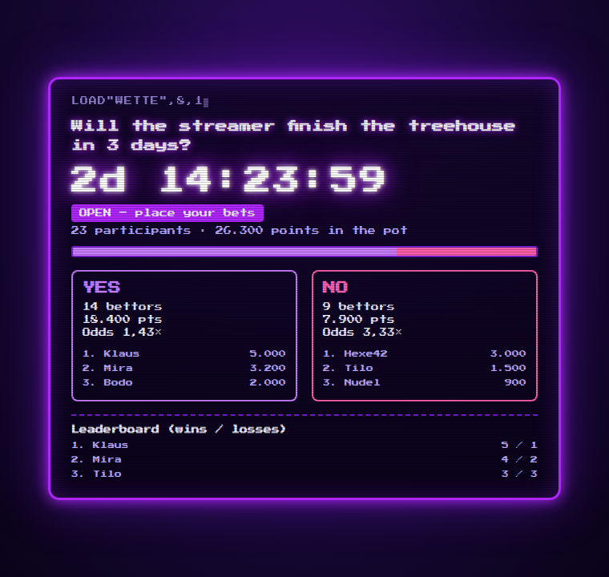
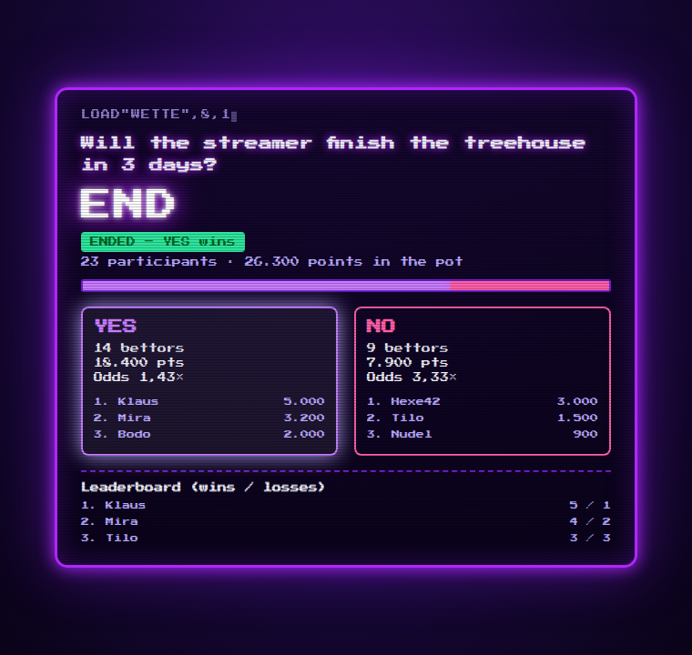
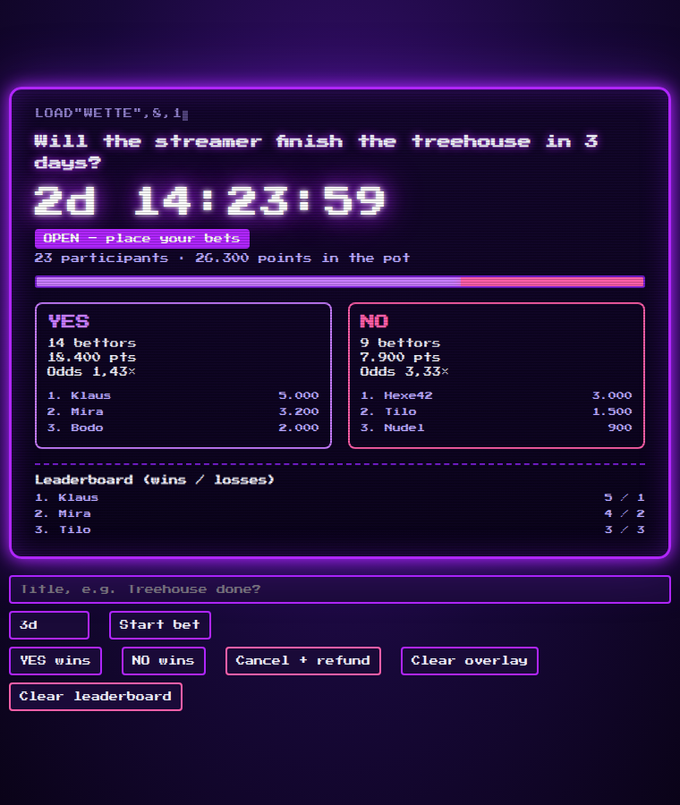
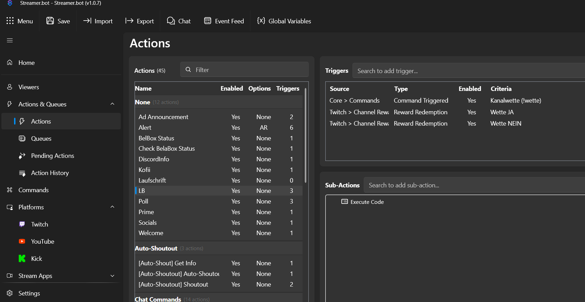
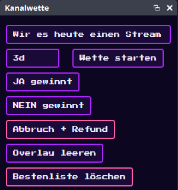

# Long-Term Channel Bet for Twitch (Streamer.bot + OBS)
# Langzeit-Kanalwette für Twitch (Streamer.bot + OBS)

[🇬🇧 English](#-english) · [🇩🇪 Deutsch](#-deutsch) · [🎬 Demo video / Demo-Video](docs/demo.mp4)



---

# 🇬🇧 English

Twitch Predictions are limited to 24 hours. This project runs a **Yes/No bet for days or weeks** using normal channel point rewards, held by Streamer.bot, with a neon/C64-style OBS overlay.

**Overlay shows:** title, remaining time, participants, points in the pot, YES/NO bar, bettors and points per side, odds, top 3 bettors per side, and a leaderboard (wins/losses).

| Overlay (open) | Result | Control dock |
|---|---|---|
|  |  |  |

## How it works and limits

- Bets are **channel point rewards** (e.g. `Bet YES 100`, `Bet NO 1000`). Redemptions stay *unfulfilled* in the queue until the bet ends.
- Streamer.bot stores the bet (title, end time, every bettor) in a persistent global variable. It survives restarts.
- **Win:** winners' redemptions are cancelled, so they **get their points back**. **Loss:** losers' redemptions are fulfilled, so the points are **gone**. **Cancel:** everybody gets everything back.
- **No payouts.** Twitch's API cannot grant channel points. The odds (pot ÷ side total) are only a display, e.g. 800 YES / 200 NO gives 1.25× for YES.
- When the time runs out the bet is **locked** and waits for you to resolve it. Late or wrong-side redemptions are refunded automatically (one side per user).
- Bonus currency / channel point exchange is intentionally **not** included. Twitch's Channel Points rules restrict exchanging points outside Twitch. Check the current policy before building on it.

## Requirements

OBS Studio (with Browser Source and Custom Browser Docks), Streamer.bot (tested layout: v1.0.7), a Twitch account connected in Streamer.bot.

## Setup

1. **WebSocket server.** Streamer.bot → *Servers/Clients → WebSocket Server*: Address `127.0.0.1`, Port `8080`, enable *Auto Start* and start it.
2. **Create rewards in Streamer.bot**, not in the Twitch dashboard (only the creating app may refund/fulfill redemptions). Streamer.bot → *Platforms → Twitch → Channel Point Rewards → Add*.
   - Names: anything containing the word **NO** or **NEIN** counts as NO, everything else as YES, e.g. `Bet YES 100`, `Bet YES 1000`, `Bet NO 100`, `Bet NO 1000`.
   - **Turn OFF "Skip Reward Requests Queue"** (redemptions must stay unfulfilled). Leave cooldowns and max-per-stream off.
3. **Create the action.** Action name **`LB`** (exactly, the overlay calls it). Add sub-action *Core → C# → Execute C# Code*, paste [`streamerbot/LongBet.cs`](streamerbot/LongBet.cs), add the reference `Newtonsoft.Json.dll`, click *Save and Compile*.
4. **Add triggers to `LB`:**
   - *Core → Commands → Command Triggered*: `!wette` (permission: Broadcaster/Moderators only).
   - *Twitch → Channel Reward → Reward Redemption* for **each** bet reward.

   
5. **OBS overlay.** Add a *Browser Source*, tick *Local file*, choose [`overlay/long-bet-overlay.html`](overlay/long-bet-overlay.html), size about 700×700. Show/hide the source to show/hide the overlay.
6. **OBS control dock.** *Docks → Custom Browser Docks*, URL: `file:///C:/path/to/overlay/long-bet-overlay.html?panel=1&lang=en`.

   

## Commands (also available as dock buttons)

| Command | Effect |
|---|---|
| `!wette start 3d Will the treehouse be finished?` | Start a bet. Units: `m`, `h`, `d` |
| `!wette end yes` / `!wette end no` | Resolve: winners refunded, losers' points consumed |
| `!wette cancel` | Cancel, refund everyone |
| `!wette reset` | Clear the overlay |
| `!wette boardreset` | Clear the leaderboard |
| `!wette sync` | Re-send the state to the overlay |

(German aliases `ende ja|nein` and `abbruch` also work; the dock uses them.)

## Overlay URL parameters

`?lang=en` English UI · `?panel=1` control dock · `?demo=1` preview with fake data · `?host=127.0.0.1&port=8080` WebSocket address.

## Troubleshooting

- **Nothing is shown:** the overlay must subscribe to `General.Custom` (already done in this version). Check that the WebSocket server is running and *Refresh* the browser source / reload the dock.
- **Test the 24h+ behavior first:** run a small reward for more than a day before your first real bet. Also verify the C# API names `TwitchRedemptionCancel` / `TwitchRedemptionFulfill` compile in your version.
- Rewards are not hidden automatically. Without a running bet, redemptions are refunded immediately.
- Chat messages in the C# file are German. Edit the `CPH.SendMessage(...)` strings to translate them.

## Files

```
overlay/long-bet-overlay.html   OBS browser source + control dock
streamerbot/LongBet.cs          Streamer.bot C# (action "LB")
docs/demo.mp4                   25 s overlay demo (YouTube-ready)
docs/img/                       screenshots
```

---

# 🇩🇪 Deutsch

Twitch-Predictions sind auf 24 Stunden begrenzt. Dieses Projekt hält eine **Ja/Nein-Wette über Tage oder Wochen** mit normalen Kanalpunkte-Belohnungen in Streamer.bot und zeigt sie in einem Neon/C64-Overlay für OBS.

**Das Overlay zeigt:** Titel, Restzeit, Teilnehmer, Punkte im Topf, JA/NEIN-Balken, Wetter und Punkte je Seite, Quote, Top 3 Einsätze je Seite und eine Bestenliste (Siege/Niederlagen).

## Funktionsweise und Grenzen

- Einsätze sind **Kanalpunkte-Belohnungen** (z. B. `Wette JA 100`, `Wette NEIN 1000`). Die Einlösungen bleiben bis zum Ende der Wette *unerfüllt* in der Warteschlange.
- Streamer.bot speichert die Wette (Titel, Endzeit, alle Wetter) in einer persistenten globalen Variable. Sie übersteht Neustarts.
- **Gewinn:** Die Einlösungen der Gewinner werden storniert, sie **bekommen ihre Punkte zurück**. **Verlust:** Die Einlösungen der Verlierer werden abgeschlossen, die Punkte sind **weg**. **Abbruch:** Alle bekommen alles zurück.
- **Keine Auszahlung.** Die Twitch-API kann keine Kanalpunkte gutschreiben. Die Quote (Topf ÷ Summe der Seite) ist nur eine Anzeige, z. B. 800 JA / 200 NEIN ergibt 1,25× für JA.
- Läuft die Zeit ab, ist die Wette **gesperrt** und wartet auf deine Auflösung. Zu späte Einsätze oder Einsätze auf die andere Seite werden automatisch zurückerstattet (eine Seite pro User).
- Eine Bonus-Währung bzw. ein Umtausch von Kanalpunkten ist bewusst **nicht** enthalten. Die Channel-Points-Regeln von Twitch schränken den Tausch außerhalb von Twitch ein. Prüfe die aktuelle Richtlinie, bevor du darauf aufbaust.

## Voraussetzungen

OBS Studio (mit Browser-Quelle und benutzerdefinierten Browser-Docks), Streamer.bot (getestete Oberfläche: v1.0.7), Twitch-Konto in Streamer.bot verbunden.

## Einrichtung

1. **WebSocket-Server.** Streamer.bot → *Servers/Clients → WebSocket Server*: Adresse `127.0.0.1`, Port `8080`, *Auto Start* aktivieren und starten.
2. **Belohnungen in Streamer.bot anlegen**, nicht im Twitch-Dashboard (nur die erstellende App darf Einlösungen erstatten oder abschließen). Streamer.bot → *Platforms → Twitch → Channel Point Rewards → Add*.
   - Namen: Alles mit dem Wort **NEIN** oder **NO** zählt als NEIN, alles andere als JA, z. B. `Wette JA 100`, `Wette JA 1000`, `Wette NEIN 100`, `Wette NEIN 1000`.
   - **„Skip Reward Requests Queue" ausschalten** (Einlösungen müssen unerfüllt bleiben). Abklingzeit und Limits aus.
3. **Action anlegen.** Name exakt **`LB`** (das Overlay ruft sie auf). Sub-Action *Core → C# → Execute C# Code*, [`streamerbot/LongBet.cs`](streamerbot/LongBet.cs) einfügen, Referenz `Newtonsoft.Json.dll` hinzufügen, *Save and Compile*.
4. **Trigger zur Action `LB` hinzufügen:**
   - *Core → Commands → Command Triggered*: `!wette` (Berechtigung: nur Broadcaster/Moderatoren).
   - *Twitch → Channel Reward → Reward Redemption* für **jede** Wett-Belohnung.

   
5. **OBS-Overlay.** *Browser-Quelle* hinzufügen, *Lokale Datei* aktivieren, [`overlay/long-bet-overlay.html`](overlay/long-bet-overlay.html) wählen, Größe ca. 700×700. Quelle ein-/ausblenden = Overlay ein-/ausblenden.
6. **OBS-Steuerung.** *Docks → Benutzerdefinierte Browser-Docks*, URL: `file:///C:/Pfad/zu/overlay/long-bet-overlay.html?panel=1`.

## Befehle (auch als Dock-Buttons)

| Befehl | Wirkung |
|---|---|
| `!wette start 3d Wird das Baumhaus fertig?` | Wette starten. Einheiten: `m`, `h`, `d` |
| `!wette ende ja` / `!wette ende nein` | Auflösen: Gewinner bekommen Punkte zurück, Verlierer verlieren sie |
| `!wette abbruch` | Abbrechen, alle bekommen alles zurück |
| `!wette reset` | Overlay leeren |
| `!wette boardreset` | Bestenliste löschen |
| `!wette sync` | Stand erneut ans Overlay senden |

## Overlay-URL-Parameter

`?lang=en` englische Oberfläche · `?panel=1` Steuer-Dock · `?demo=1` Vorschau mit Testdaten · `?host=127.0.0.1&port=8080` WebSocket-Adresse.

## Fehlersuche

- **Nichts wird angezeigt:** Das Overlay muss `General.Custom` abonnieren (in dieser Version schon eingebaut). WebSocket-Server prüfen, Browser-Quelle *Aktualisieren* bzw. Dock neu laden.
- **24h+ zuerst testen:** Teste vor der ersten echten Wette eine kleine Belohnung über mehr als einen Tag. Prüfe auch, ob die C#-Aufrufe `TwitchRedemptionCancel` / `TwitchRedemptionFulfill` in deiner Version kompilieren.
- Belohnungen werden nicht automatisch ausgeblendet. Ohne laufende Wette werden Einlösungen sofort erstattet.

## Lizenz

MIT, siehe [LICENSE](LICENSE). Nicht mit Twitch verbunden oder von Twitch unterstützt.
